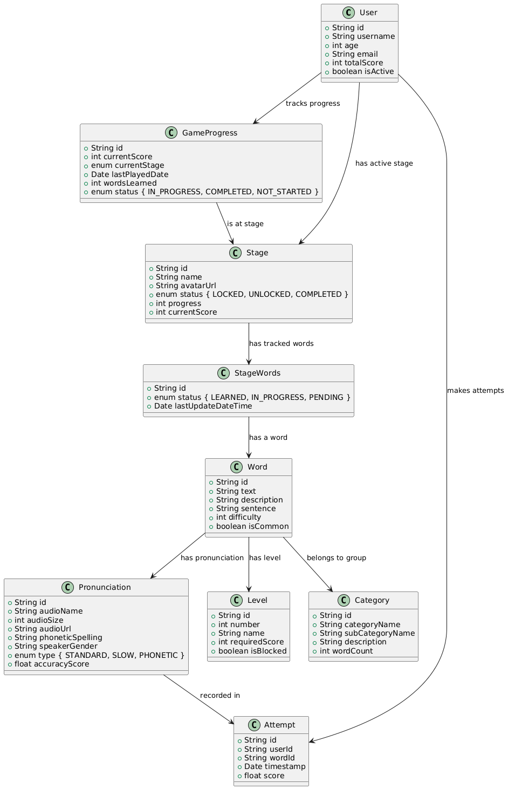

# Descripción
Este PR introduce mejoras en la estructura de datos de la aplicación Spring Boot, enfocándose en la optimización del modelo de entidades y la correcta implementación de relaciones en JPA. Se han creado las relaciones One-to-One, Many-to-Many, One-to-Many y Many-to-One. Además, se han implementado pruebas para validar el correcto funcionamiento del sistema.

1. **Revisar y Mejorar Model v0.2**
    - Se ha analizado el diagrama de clases proporcionado.
    - Se han identificado mejoras o relaciones faltantes.
    - Se ha actualizado el modelo según sea necesario.

2. **Implementar One-to-One: User y GameProgress**
    - Se ha creado una relación bidireccional **One-to-One**.
    - Se ha definido a **User** como el lado propietario de la relación.
    - Se han utilizado las anotaciones adecuadas de JPA (`@OneToOne`, `@JoinColumn`).

3. **Crear Many-to-Many: Word y Category**
    - Se ha implementado una relación **Many-to-Many**.
    - Se ha creado una tabla de unión utilizando la anotación `@JoinTable`.
    - Se ha configurado la relación bidireccional si era necesario.

4. **Implementar One-to-Many y Many-to-One Relationships**
    - Se han identificado e implementado todas las relaciones **One-to-Many** y **Many-to-One** a partir del diagrama de clases.
    - Se han utilizado las anotaciones correspondientes (`@OneToMany`, `@ManyToOne`).
    - Se han configurado los tipos de cascada y estrategias de recuperación adecuadas.

5. **Configurar Anotaciones de JPA**
    - Se han asegurado que todas las entidades tengan las anotaciones adecuadas de JPA.
    - Se ha configurado `@Id, @GeneratedValue` para las claves primarias.
    - Se han utilizado `@Column` para configuraciones específicas de las columnas.

6. **Crear Interfaces de Repositorio**
    - Se han desarrollado interfaces `JpaRepository` para cada entidad.
    - Se han añadido métodos de consulta personalizados si era necesario.

7. **Implementar Métodos Básicos de Servicio**
    - Se han creado clases de servicio para cada entidad.
    - Se han implementado operaciones **CRUD** en la capa de servicio.

8. **Probar Relaciones**
    - Se ha creado una clase de prueba para poblar la base de datos con datos de muestra.
    - Se ha verificado que todas las relaciones funcionan correctamente.
    - Se han probado las operaciones en cascada y las estrategias de recuperación.

---

## Capturas

### **Análisis y Mejora del Modelo**
> **Diagrama de clases actualizado**
